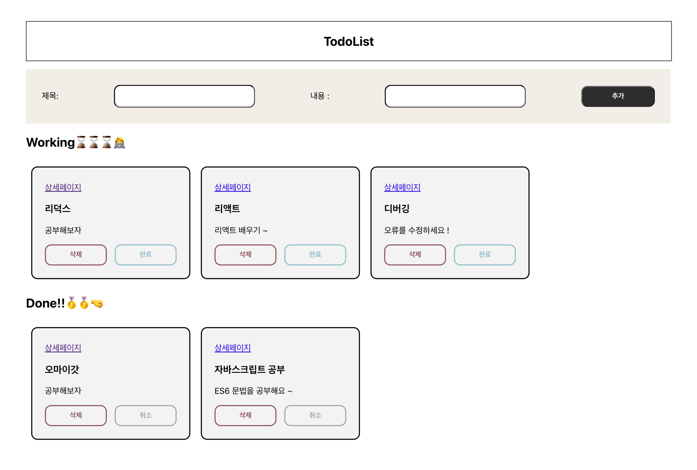

#### todo-react-lv2
```
Todo Web Application Level2
```

+ Library
  + React

+ Team member
  + [mmms2000](https://github.com/mmms2000)
  + [leolego03](https://github.com/leolego03)

#### Design


#### Code Convention
```
Pascal Case: Component
Camel Case: Function, Variable
```

#### Roles
```
mmms2000: Redux, Styled-Component
leolego03: Router, CSS
```